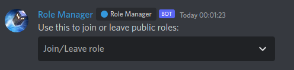

# RoleManager [](https://github.com/KarlOfDuty/RoleManager/releases) [](https://github.com/KarlOfDuty/RoleManager/releases) [](https://discord.gg/C5qMvkj)

A Discord bot which allows users to join and leave roles using a selection box.



Also includes a command for mods to ping specific roles which are normally unpingable.

## Commands
| Command               | Description                                                                                  |
|-----------------------|----------------------------------------------------------------------------------------------|
| `/addrole <role>`     | Adds a role to the bot so users can join it.                                                 |
| `/removerole <role>`  | Removes a role from the bot so users can no longer join it.                                  |
| `/createroleselector` | Creates a role selector message like in the image above.                                     |
| `/ping <role>`        | Pings a role which would normally be un-pingable. Role must be added as joinable in the bot. |

## Installation

1. Install .NET 6 if it doesn't already exist on your system.
2. [Create a new bot application and invite it to your server](docs/CreateBot.md).
3. Go to `Settings->Integrations->Bot->Command Permissions` and turn off command access for the everyone role.
4. Download the bot for your operating system, either a [release version](https://github.com/KarlOfDuty/RoleManager/releases) or a [dev build](https://jenkins.karlofduty.com/blue/organizations/jenkins/RoleManager/activity)
5. Run `./RoleManager` on Linux or `./RoleManager.exe` on Windows to generate the config.
6. Set up the config to your specifications, there are instructions inside.
7. Restart the bot.
8. Go to `Settings->Integrations->Bot->Command Permissions` in your Discord server to set up permissions for the commands.

**If you need more help either contact me in Discord or through an issue here.**

## Config settings

This is the default included config:
```yaml
bot:
    # Bot token.
    token: "<add-token-here>"
    # ID of the Discord server
    server-id: 000000000000000000
    # Decides what messages are shown in console
    # Possible values are: Critical, Error, Warning, Information, Debug.
    console-log-level: "Information"
    # Sets the type of activity for the bot to display in its presence status
    # Possible values are: Playing, Streaming, ListeningTo, Watching, Competing
    presence-type: "ListeningTo"
    # Sets the activity text shown in the bot's status
    presence-text: "role requests"
```
