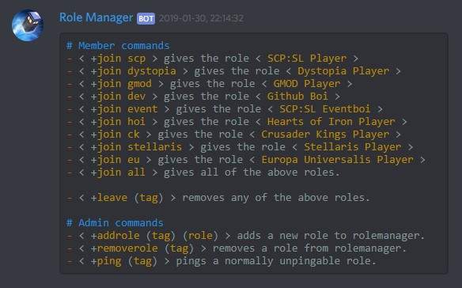

RoleManager
======
A Discord bot which allows users to add or remove roles using commands.

## Commands

`join <tag>` - Grants a member the role represented by this tag.

`leave <tag>` - Removes a role from that member.

`help` - Shows a help window with command information.



`addrole <new tag> <role name>` - Adds a new role command to the bot.

`removerole <tag>` - Removes a role command from the bot.

`ping <tag>` - Pings an unpingable role (Requires manage roles permission).

## Installation

1. Install Node either by direct download: https://nodejs.org/en/download/ or via package manager in linux distros: https://nodejs.org/en/download/package-manager/
2. Set up your config according to the guide below.
3. Run either via start.bat/start.sh or by entering `node <path to root dir>` in the terminal.

If it complains that it cannot find all components you may need to run `npm install discord.js` and `npm install discord.js` in the bot folder.

I also recommend having a look at [pm2](http://pm2.keymetrics.io/) to manage node.js scripts such as this one. It will restart them if they crash and let you easily stop and start them.

## Config settings

This is the default included config:
```yaml
### The following is the config settings I personally use as an example on how to set it up.

# Your bot token
token: ""

# Prefix for discord commands
prefix: "+"

# Sends more console messages
verbose: false

# Sets which channels users can use commands in and which users have permission to use the commands.
# Permissions can be given to Discord roles and individual Discord users. All of the config arrays use IDs, not names.
# Set to "*" to allow everything.
commands:
    join:
        channels: [ "449876787162251285" ]
        permissions:
            roles: [ "*" ]
            users: []
    leave:
        channels: [ "449876787162251285" ]
        permissions:
            roles: [ "*" ]
            users: []
    help:
        channels: [ "449876787162251285" ]
        permissions:
            roles: [ "*" ]
            users: []
    addrole:
        channels: [ "*" ]
        permissions:
            roles: [ "430474354875432960", "478633725534666752", "439020448710262784", "448776874492035083", "448775229381279774" ]
            users: []
    removerole:
        channels: [ "*" ]
        permissions:
            roles: [ "430474354875432960", "478633725534666752", "439020448710262784", "448776874492035083", "448775229381279774" ]
            users: []
    ping:
        channels: [ "*" ]
        permissions:
            roles: [ "430474354875432960", "478633725534666752", "439020448710262784", "448776874492035083", "448775229381279774" ]
            users: []
```
