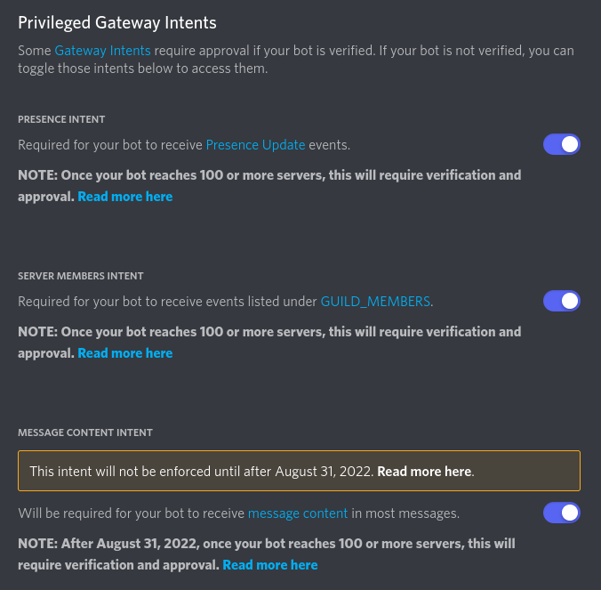
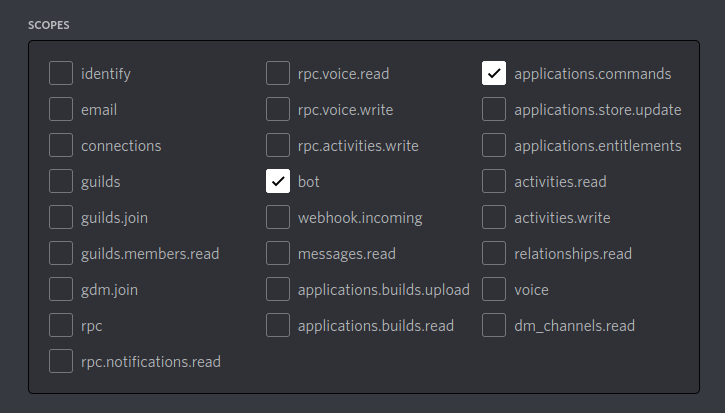

# Creating a bot application

1. [Create a new bot application](https://discord.com/developers/applications). Click add bot on the bot tab. 
2. Turn on all intents on the bot page: 

4. Generate an invite link on the OAuth2 page with the following scopes:

6. Invite the bot using the invite link.